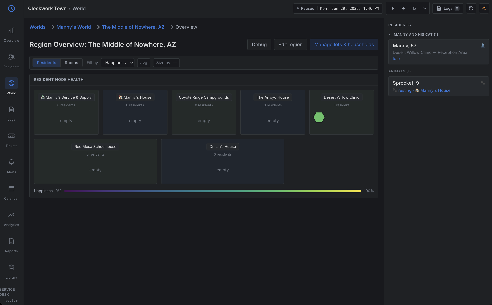
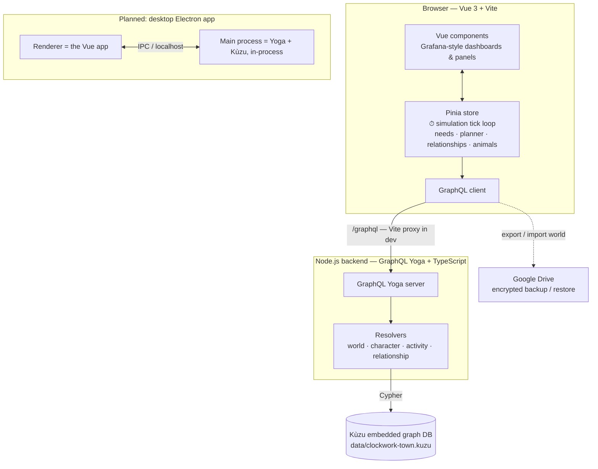

# Clockwork Town

A **text-based life simulator** with an unusual skin: it's presented as a Grafana-style
observability dashboard — an "IT service desk for the human soul." Residents are nodes,
their needs are metrics, their lives stream past as logs, and a neglected friendship or
a looming grief shows up as an alert or a ticket.

The goal is to **treat inner life with deadpan affection** — to take loneliness,
fulfillment, grief, and the small rituals of a day seriously, while rendering them in
the flat, earnest language of uptime monitoring. The humor comes from the framing; the
care is real. It is not a parody of mental health, and the heavier material (illness,
loss, grief) is meant to be handled with that same affection, not for shock.

> ⚠️ **Very early, experimental work-in-progress.** This is in active development with
> incomplete features and rough edges throughout. The long-term vision is a town you
> manage — many households, jobs, relationships, illness and grief, a tutorial, default
> towns — but it is **not there yet**. Today you can stand up a small world and watch a
> handful of residents tick through their needs and daily routines. The screenshot below
> is a tiny test world with a single resident (and his cat), not a finished town. See
> [`docs/roadmap/`](docs/roadmap/README.md) for the full, dependency-ordered plan of
> where it's headed.



## Architecture

Clockwork Town is a local-first, single-player app. One slightly unusual choice worth
calling out up front: **the simulation tick loop runs in the browser** (in the Pinia
store), and the backend is mostly a typed persistence layer over the database. That
keeps the sim responsive (no network round-trip per tick) and keeps all the
domain logic in one place.



### Why these tools

- **Kùzu (embedded graph database)** — the domain *is* a graph: people, places, items,
  households, family trees, relationships, and memories are densely interconnected.
  Cypher queries like "who is co-located," "what's this character's family tree," or
  "how have these two drifted apart" are natural in a graph DB and awkward as SQL joins.
  Being **embedded** (the whole save is one local file) fits a single-player, offline,
  local-first game — there's no database server to operate — and makes the planned
  Electron packaging clean, since Kùzu's native Node module runs directly in the main
  process.
- **GraphQL Yoga (schema-first)** — gives a typed, self-documenting contract between the
  simulation frontend and the data layer, with the API defined explicitly in
  `src/schema.graphql`. (For a single-user local app the HTTP layer is arguably more
  than strictly necessary — but it cleanly separates persistence from sim logic and is
  straightforward to fold into Electron IPC later.)
- **Vue 3 + Pinia + Vite** — the UI is a live view over constantly-changing simulation
  state, which maps well onto Vue's reactivity with little glue. The sim's per-tick loop
  lives in the Pinia store; Vite gives fast hot-reload during development.
- **Tailwind CSS v4** — quick, consistent styling for a dense dashboard UI, with design
  tokens modelling the Grafana-dark theme.
- **ECharts** — time-series (happiness over time, need trends) and node-graph
  (relationships) visualizations that fit the observability-dashboard concept.

### Layout

- `src/` — backend: `schema.graphql` (API), `resolvers/` (by domain), `kuzu.ddl.sql`
  (DB schema), `db.ts` (connection), `kuzuHelpers.ts` (`q`, `batch`).
- `frontend/` — Vue app. The simulation lives in `frontend/src/stores/` (the tick loop,
  needs/planner, relationship and animal runtimes).
- `docs/roadmap/` — the plan of record.

## Running it locally

**Prerequisites:** Node.js 20+ and npm. There's an `.nvmrc` pinning Node 22 (`nvm use`),
which is what this is tested against. One dependency (the Kùzu database) is a native
module, so `npm install` compiles/downloads a platform-specific binary — see
[Troubleshooting](#troubleshooting) if install fails.

> Tested on macOS (Apple Silicon) with Node 22. Other platforms should work but are
> less exercised; if you hit a snag, the Troubleshooting section covers the usual ones.

```bash
git clone <repo-url>
cd clockwork
npm ci        # clean, lockfile-exact install (use this, not `npm install`, for a reproducible setup)
```

Run the backend and frontend in two terminals:

```bash
# Terminal 1 — backend (GraphQL + database)
npm run dev          # serves http://localhost:4000/graphql
                     # creates ./data and applies the DB schema automatically on first run
```

```bash
# Terminal 2 — frontend (hot reload)
npm run dev:frontend # serves http://localhost:5173 and proxies /graphql to the backend
```

Then open **http://localhost:5173**.

The database starts **empty** — there's no bundled town yet (shippable default towns
and a tutorial are on the roadmap). Create a World → Region → Lots/Households/Characters
in the UI to get going.

**If port 4000 is already in use,** start the backend on another port and point the
Vite `/graphql` proxy at the same port:

```bash
PORT=4001 npm run dev
# then set the proxy target in vite.config.ts to http://localhost:4001
```

**Production-style run** (backend serves the built frontend on one port):

```bash
npm run build:frontend
npm start             # visit http://localhost:4000
```

**Tests:** `npx vitest run` (a few `taskLifecycle` tests are known-failing and unrelated
to current work).

## Troubleshooting

- **The page at localhost:5173 is blank or shows network/GraphQL errors.** You need
  *both* servers running — the backend (`npm run dev`) and the frontend
  (`npm run dev:frontend`) — in separate terminals. The frontend proxies `/graphql` to
  the backend, so it can't load data on its own.
- **The app loads but there are no worlds / nothing is happening.** That's expected on a
  fresh clone — the database starts empty. Create a World → Region → Lots/Households/
  Characters in the UI, then use the play/▶ control to run the simulation. (A bundled
  starter town is on the roadmap.)
- **`npm ci` fails while building/installing `kuzu`.** Kùzu is a native module. Make
  sure you're on Node 20+ (`nvm use` honors the bundled `.nvmrc`). If a prebuilt binary
  isn't available for your OS/architecture, you may need standard native-build tools
  (a C/C++ toolchain; on Windows, the VS Build Tools). Re-running `npm ci` after fixing
  the toolchain usually resolves it.
- **Backend exits immediately with `EADDRINUSE`.** Something else is using port 4000.
  Start the backend on another port and match the Vite proxy (see the port note above).
- **`npm start` shows the API but a stale or missing UI.** `npm start` serves the
  *built* frontend — run `npm run build:frontend` first, or use the two-terminal dev
  flow above.

## Backups

A world can be exported/imported as an encrypted, password-protected backup to Google
Drive from within the app.

## Roadmap & future direction

The dependency-ordered plan lives in [`docs/roadmap/`](docs/roadmap/README.md). The
near-future packaging goal is a **desktop Electron app** that runs the backend and the
embedded Kùzu database in the main process, so the whole thing ships as a single
double-click app with no separate server to start. Desktop-only; mobile is not planned.
The project is text-only by design — there are no images in the product, and none are
planned. (The screenshot above is documentation, not a product asset.)

## License

[MIT](LICENSE).
