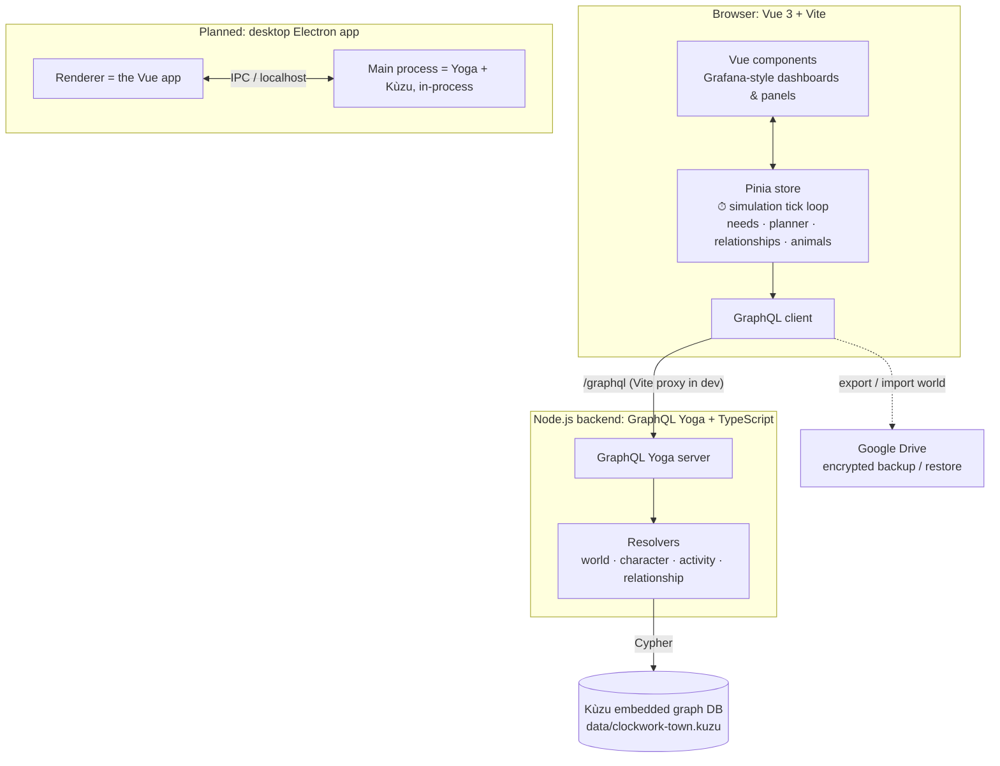
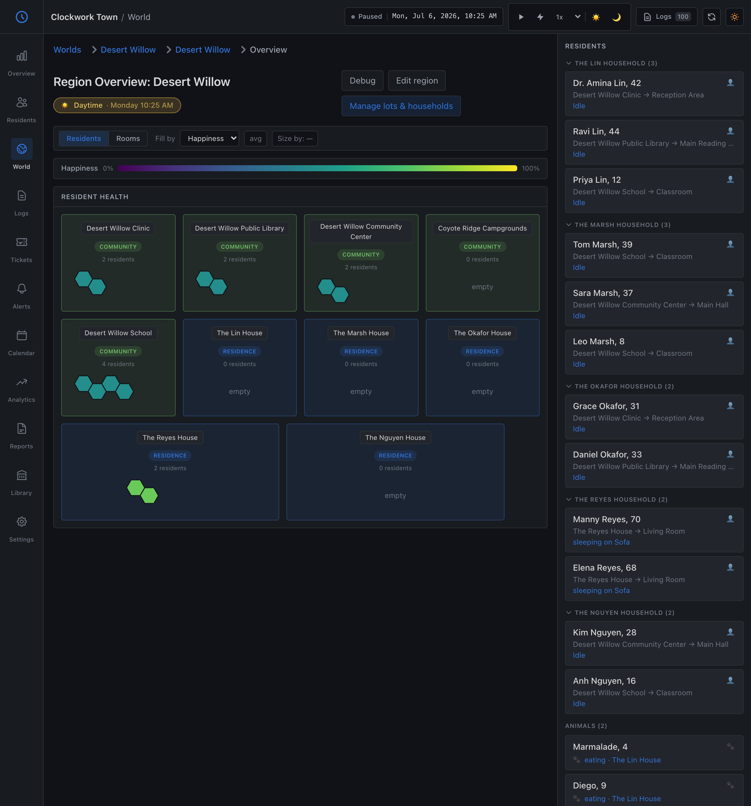
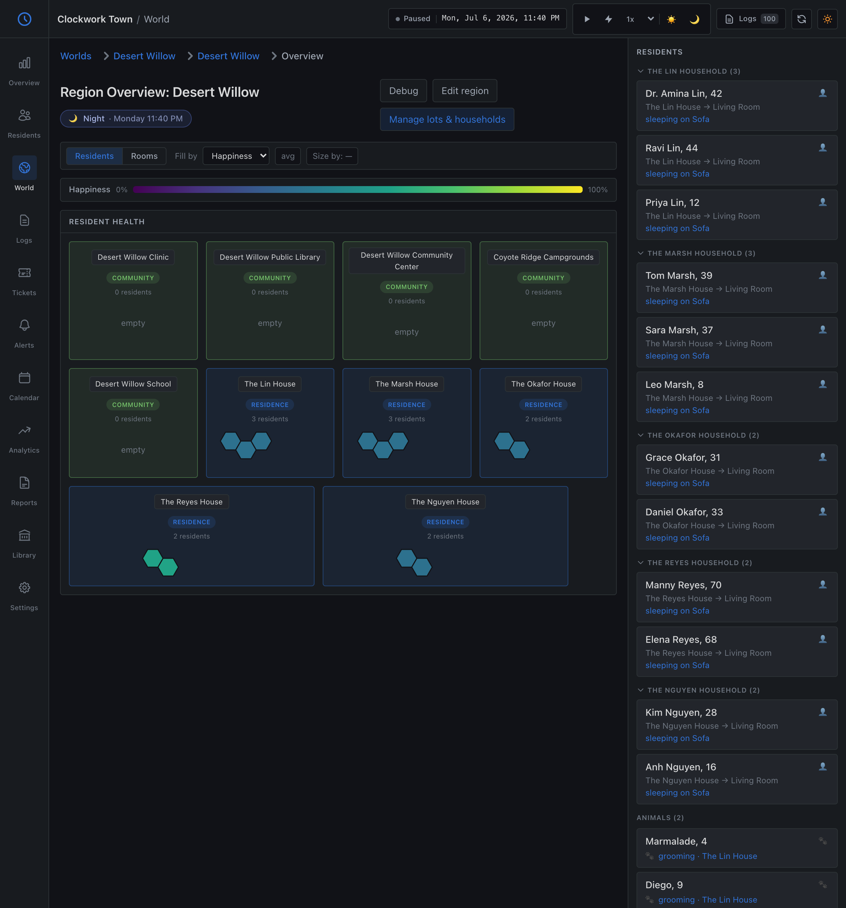

# Clockwork Town

[](https://github.com/gennit-project/clockwork-town/actions/workflows/ci.yml)

A **text-based life simulator** with an unusual skin: it's presented as a Grafana-style
observability dashboard, an "IT service desk for the human soul." Residents are nodes,
their needs are metrics, their lives stream past as logs, and a neglected friendship or
a looming grief shows up as an alert or a ticket.

The goal is to **treat inner life with deadpan affection**: to take loneliness,
fulfillment, grief, and the small rituals of a day seriously, while rendering them in
the flat, earnest language of uptime monitoring. The humor comes from the framing; the
care is real. It is not a parody of mental health, and the heavier material (illness,
loss, grief) is meant to be handled with that same affection, not for shock.

> **Status: a work-in-progress portfolio project.** The core loop works today: seed a
> town and watch its residents move through a day, commuting to work and school by day,
> heading home to sleep at night, and building friendships and family ties that surface on
> a live relationship graph (see the [day/night screenshots](#day-and-night) below). It is
> not feature-complete, and I'm not pretending otherwise; the roadmap (more households,
> jobs, illness and grief, a tutorial) is deliberately larger than what's built. What's
> here is meant to show the shape of the idea and the engineering under it: a browser-side
> simulation over a typed GraphQL persistence layer, lint- and type-checked with CI. The
> full, dependency-ordered plan lives in [`docs/roadmap/`](docs/roadmap/README.md).

## Architecture

Clockwork Town is a local-first, single-player app. One slightly unusual choice worth
calling out up front: **the simulation tick loop runs in the browser** (in the Pinia
store), and the backend is mostly a typed persistence layer over the database. That
keeps the sim responsive (no network round-trip per tick) and keeps all the
domain logic in one place.




### Why these tools

- **Kùzu (embedded graph database)**: the domain *is* a graph: people, places, items,
  households, family trees, relationships, and memories are densely interconnected.
  Cypher queries like "who is co-located," "what's this character's family tree," or
  "how have these two drifted apart" are natural in a graph DB and awkward as SQL joins.
  Being **embedded** (the whole save is one local file) fits a single-player, offline,
  local-first game (there's no database server to operate) and makes the planned
  Electron packaging clean, since Kùzu's native Node module runs directly in the main
  process.
- **GraphQL Yoga (schema-first)**: gives a typed, self-documenting contract between the
  simulation frontend and the data layer, with the API defined explicitly in
  `src/schema.graphql`. (For a single-user local app the HTTP layer is arguably more
  than strictly necessary, but it cleanly separates persistence from sim logic and is
  straightforward to fold into Electron IPC later.)
- **Vue 3 + Pinia + Vite**: the UI is a live view over constantly-changing simulation
  state, which maps well onto Vue's reactivity with little glue. The sim's per-tick loop
  lives in the Pinia store; Vite gives fast hot-reload during development.
- **Tailwind CSS v4**: quick, consistent styling for a dense dashboard UI, with design
  tokens modeling the Grafana-dark theme.
- **ECharts**: time-series (happiness over time, need trends) and node-graph
  (relationships) visualizations that fit the observability-dashboard concept.

### Layout

- `src/`: backend: `schema.graphql` (API), `resolvers/` (by domain), `kuzu.ddl.sql`
  (DB schema), `db.ts` (connection), `kuzuHelpers.ts` (`q`, `batch`).
- `frontend/`: Vue app. The simulation lives in `frontend/src/stores/` (the tick loop,
  needs/planner, relationship and animal runtimes).
- `docs/roadmap/`: the plan of record.

## Running it locally

**Prerequisites:** Node.js 20+ and npm. There's an `.nvmrc` pinning Node 22 (`nvm use`),
which is what this is tested against. One dependency (the Kùzu database) is a native
module, so `npm install` compiles/downloads a platform-specific binary (see
[Troubleshooting](#troubleshooting) if install fails).

> Tested on macOS (Apple Silicon) with Node 22. Other platforms should work but are
> less exercised; if you hit a snag, the Troubleshooting section covers the usual ones.

```bash
git clone <repo-url>
cd clockwork
npm ci        # clean, lockfile-exact install (use this, not `npm install`, for a reproducible setup)
```

Run the backend and frontend in two terminals:

```bash
# Terminal 1: backend (GraphQL + database)
npm run dev          # serves http://localhost:4000/graphql
                     # creates ./data and applies the DB schema automatically on first run
```

```bash
# Terminal 2: frontend (hot reload)
npm run dev:frontend # serves http://localhost:5173 and proxies /graphql to the backend
```

Then open **http://localhost:5173**.

### Seed the demo worlds

The database starts **empty**. To populate two ready-made towns, run the seed with the
backend **stopped**:

```bash
npm run seed          # ⚠️ resets ./data/clockwork-town.kuzu, then builds both worlds
```

This builds:

- **Desert Willow**: a full town: 12 characters across 5 households, community lots
  (clinic, library, community center, school, campground) and residential homes.
- **Pinehaven**: a smaller companion town: 5 characters across 2 households, with its own
  clinic, library, and school (there to show the app handles more than one world).

Then start the servers. On load the app opens the **default world's Overview** (Desert
Willow) so there's data immediately; use the **world dropdown in the top nav** to switch
between towns; it keeps you on the same section (Residents, World, Logs…) in the new
world. Every character has a weekday schedule, so once you press **▶ play** each town comes
to life: adults commute to work, kids head to school, and everyone returns home to sleep at
night. (You can also still build your own World → Region → Lots/Households/Characters in
the UI.)

Some sidebar sections (Tickets, Alerts, Analytics, Reports, Settings, Calendar) are
placeholders and are **hidden by default** so the app reads as finished. To see them while
developing, run the frontend with `VITE_SHOW_UNFINISHED=true`.

### Day and night

The region header shows a **day/night indicator** (☀️/🌙 + clock), and community vs.
residential lots are color-coded (green **Community** / blue **Residence** badges). Press
**▶ play** and let the clock run to watch the town move through its day:

**☀️ Weekday morning**



**🌙 Late evening**



*The same town by day and by night: during the day the clinic, library, community center,
and school fill up while homes empty out (only the retired Reyes couple stays in); at night
everyone is back home asleep. The right rail lists each resident's current location and
activity.*

**If port 4000 is already in use,** start the backend on another port and point the
Vite `/graphql` proxy at the same port:

```bash
PORT=4001 npm run dev
# then set the proxy target in vite.config.ts to http://localhost:4001
```

**Production-style run** (backend serves the built frontend on one port):

```bash
npm run build:frontend
npm start             # visit http://localhost:4000
```

**Quality checks:** `npm run lint`, `npm run typecheck`, and `npx vitest run` all pass, and
run on every push/PR via GitHub Actions (`.github/workflows/ci.yml`).

## Troubleshooting

- **The page at localhost:5173 is blank or shows network/GraphQL errors.** You need
  *both* servers running: the backend (`npm run dev`) and the frontend
  (`npm run dev:frontend`), in separate terminals. The frontend proxies `/graphql` to
  the backend, so it can't load data on its own.
- **The app loads but there are no worlds / nothing is happening.** That's expected on a
  fresh clone; the database starts empty. Run `npm run seed` (with the backend stopped) to
  build the demo towns, or create a World → Region → Lots/Households/Characters in the UI,
  then use the play/▶ control to run the simulation.
- **`npm ci` fails while building/installing `kuzu`.** Kùzu is a native module. Make
  sure you're on Node 20+ (`nvm use` honors the bundled `.nvmrc`). If a prebuilt binary
  isn't available for your OS/architecture, you may need standard native-build tools
  (a C/C++ toolchain; on Windows, the VS Build Tools). Re-running `npm ci` after fixing
  the toolchain usually resolves it.
- **Backend exits immediately with `EADDRINUSE`.** Something else is using port 4000.
  Start the backend on another port and match the Vite proxy (see the port note above).
- **`npm start` shows the API but a stale or missing UI.** `npm start` serves the
  *built* frontend; run `npm run build:frontend` first, or use the two-terminal dev
  flow above.

## Backups

A world can be exported/imported as an encrypted, password-protected backup to Google
Drive from within the app.

## Roadmap & future direction

The dependency-ordered plan lives in [`docs/roadmap/`](docs/roadmap/README.md). The
near-future packaging goal is a **desktop Electron app** that runs the backend and the
embedded Kùzu database in the main process, so the whole thing ships as a single
double-click app with no separate server to start. Desktop-only; mobile is not planned.
The project is text-only by design: there are no images in the product, and none are
planned; the screenshots above are of the actual dashboard UI.

## License

[MIT](LICENSE).
